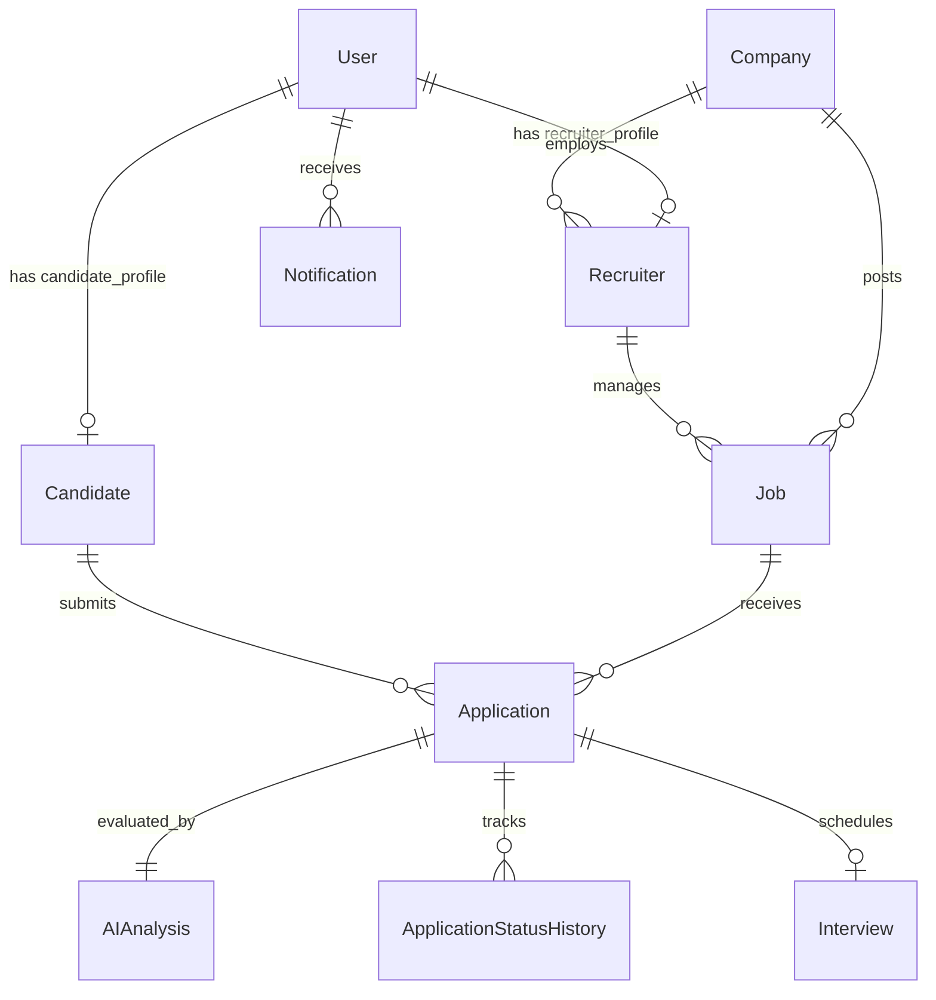
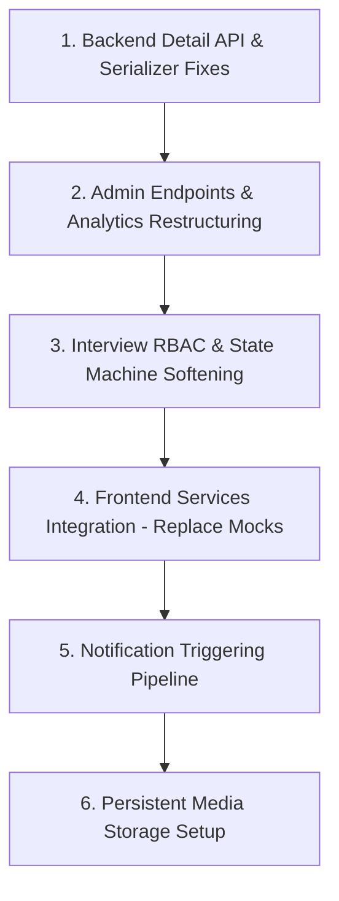

# SmartATS — Comprehensive System Audit & Production Readiness Assessment

**Document Version:** 1.0.0  
**Audit Date:** October 2026  
**Scope:** Full-Stack Architecture, Backend (Django/DRF), Frontend (React/Vite), AI Engine (PyMuPDF, spaCy, Sentence-Transformers, scikit-learn), Data Integrity, RBAC, Deployment Infrastructure, and API Contracts.  
**Repository Source:** [https://github.com/manthanshah/documents/Smart_ATS](https://github.com/manthanshah07/Smart_ATS)

---

## 1. Executive Summary

SmartATS is designed as an explainable, AI-powered Applicant Tracking System (ATS) targeting three distinct personas: **Candidates**, **Recruiters**, and **Platform Administrators**. The core value proposition is an explainable resume-to-job matching pipeline combining Dense Semantic Vectors (`all-MiniLM-L6-v2`), Rule/Heuristic NLP entity parsing (`spaCy en_core_web_sm`), and deterministic skill/experience weighting (60% Semantic, 30% Skill Overlap, 10% Experience Alignment).

### Current System Health Snapshot
* **Backend Foundation:** **Solid core**. Django models, custom email authentication, JWT rotation/blacklisting, transactional registration, database-level state machine validation, and explainable AI scoring math are implemented and passing unit tests.
* **Frontend Surface:** **Visually polished but partially disconnected**. While UI pages exist for all roles, multiple frontend services (`adminService`, `interviewService`, `notificationService`, `aiService`, `recruiterService`) remain bound to mock in-memory data, hardcoded IDs, or exhibit critical contract mismatches with the Django REST Framework endpoints.
* **Core Blocking Issue:** Absence of a generic `GET /api/v1/applications/<id>/` detail endpoint and client-side assumption that recruiter evaluation dossiers can be loaded via the candidate-restricted `/api/v1/candidate/applications/` endpoint.

---

## 2. Current Architecture

```
                                  +---------------------------------------+
                                  |         Vercel (React + Vite)         |
                                  |  - Client SPA & Router (AppRoutes)   |
                                  |  - Tailwind CSS + Lucide Icons        |
                                  |  - Axios API Client + JWT Interceptors|
                                  +-------------------+-------------------+
                                                      |
                                             HTTPS / JSON API
                                                      |
                                                      v
                                  +---------------------------------------+
                                  |         Render (Django 5.1.x)         |
                                  |  - WhiteNoise Static File Server      |
                                  |  - Gunicorn WSGI Worker Pool          |
                                  |  - SimpleJWT Auth & RBAC Middleware   |
                                  |  - AI Pipeline (In-Process Sync)      |
                                  +-------------------+-------------------+
                                                      |
                                    +-----------------+-----------------+
                                    |                                   |
                                    v                                   v
                      +---------------------------+       +---------------------------+
                      |   Neon Cloud PostgreSQL   |       |   Render Ephemeral Disk   |
                      |  - User, Roles & Profiles |       |  - Uploaded Resumes (PDF) |
                      |  - Jobs & Applications    |       |  - Company Logos (Media)  |
                      |  - AI Analysis & Snapshots|       |  *(Risk: Lost on restart) |
                      +---------------------------+       +---------------------------+
```

### Layer Breakdown
1. **Frontend Client Layer:**
   - **Framework:** React 18, Vite, React Router v6, Axios.
   - **State & Context:** `AuthContext` manages user authentication, role tracking, and tokens stored in `localStorage`.
   - **Styling:** Tailwind CSS with modern UI component primitives (`Card`, `Badge`, `Modal`, `StatusBadge`, `Table`).
   - **Environment:** Configured via `VITE_API_BASE_URL` and `VITE_DEMO_MODE`.

2. **Backend API Layer:**
   - **Framework:** Python 3.12, Django 5.1.x, Django REST Framework 3.15.x.
   - **Authentication:** `rest_framework_simplejwt` with rotating refresh tokens and database token blacklisting (`token_blacklist`).
   - **Modular Apps:** `accounts`, `companies`, `jobs`, `applications`, `interviews`, `notifications`, `analytics`, `ai_engine`.

3. **AI Evaluation Layer:**
   - **Text Extraction:** `PyMuPDF` (`fitz`) for PDF and `python-docx` for Word documents.
   - **Entity Extraction:** Custom `NLPExtractor` with `spaCy` (`en_core_web_sm`) and deterministic regex vocabularies (`ATS_SKILLS_VOCABULARY`).
   - **Semantic Embeddings:** `sentence-transformers` (`all-MiniLM-L6-v2`) generating 384-dimensional dense vectors.
   - **Similarity & Scoring:** Scikit-learn `cosine_similarity` for text alignment combined with weighted heuristic arithmetic.

4. **Persistence & Infrastructure:**
   - **Database:** PostgreSQL 16 (local development & Neon Cloud in production).
   - **File System:** Local `media/` directory (`FileSystemStorage`). *Ephemeral on containerized cloud hosts like Render.*

---

## 3. Implemented Features Inventory

| Subsystem | Feature / Requirement | Implemented Location | Status |
| :--- | :--- | :--- | :--- |
| **Auth** | Candidate & Recruiter Registration (FR-1) | `apps/accounts/views.py::RegisterView` | **Complete (Live)** |
| **Auth** | Email/Password JWT Login (FR-2) | `apps/accounts/views.py::CustomTokenObtainPairView` | **Complete (Live)** |
| **Auth** | JWT Token Refresh & Rotation (FR-3) | `rest_framework_simplejwt.views.TokenRefreshView` | **Complete (Live)** |
| **Auth** | Token Blacklisting / Logout | `apps/accounts/views.py::LogoutView` | **Complete (Live)** |
| **Auth** | Secure Password Reset (FR-4) | `apps/accounts/views.py::PasswordResetRequestView` | **Complete (Live)** |
| **Profile** | Candidate Profile Management (FR-5) | `apps/accounts/views.py::CandidateProfileView` | **Complete (Live)** |
| **Profile** | Candidate Resume Upload & NLP Parsing (FR-6) | `apps/accounts/views.py::CandidateResumeUploadView` | **Complete (Live)** |
| **Jobs** | Public & Candidate Job Search (FR-7) | `apps/jobs/views.py::JobListCreateView` | **Complete (Live)** |
| **Jobs** | Recruiter Job Posting & Lifecycle (FR-11) | `apps/jobs/views.py::JobListCreateView`, `JobDetailView` | **Complete (Live)** |
| **Applications** | Application Submission & Snapshotting (FR-8) | `apps/applications/views.py::ApplicationSubmitView` | **Complete (Live)** |
| **Applications** | Candidate Application Tracking (FR-9) | `apps/applications/views.py::CandidateApplicationListView`| **Complete (Live)** |
| **Applications** | Ranked Applicant Pipeline for Recruiters (FR-12)| `apps/applications/views.py::JobApplicantsRankedListView` | **Complete (Live)** |
| **Applications** | State Machine Status Updates (FR-13) | `apps/applications/views.py::ApplicationStatusUpdateView`| **Complete (Live)** |
| **Applications** | Candidate Application Withdrawal | `apps/applications/views.py::ApplicationWithdrawView` | **Complete (Live)** |
| **AI Engine** | PDF / DOCX Text Extraction | `apps/ai_engine/parser.py::ResumeParser` | **Complete (Live)** |
| **AI Engine** | Skills, Experience, Education NLP Extraction | `apps/ai_engine/extractor.py::NLPExtractor` | **Complete (Live)** |
| **AI Engine** | 384-d Dense Embeddings & Cosine Similarity | `apps/ai_engine/embeddings.py`, `matcher.py` | **Complete (Live)** |
| **AI Engine** | Explainable Weighted Match Calculation | `apps/ai_engine/matcher.py::ExplainableMatcher` | **Complete (Live)** |
| **Company** | Recruiter Company Profile Management (FR-10) | `apps/companies/views.py::RecruiterCompanyView` | **Complete (Backend Only)** |
| **Company** | Admin Company Verification (FR-21) | `apps/companies/views.py::AdminCompanyModerationView` | **Partial (Missing List)** |
| **Interviews** | Recruiter Scheduling & Candidate List (FR-14) | `apps/interviews/views.py::InterviewListCreateView` | **Complete (Backend Only)** |
| **Notifications**| In-App Notification Feed (FR-23, FR-24) | `apps/notifications/views.py::NotificationListView` | **Complete (Backend Only)** |
| **Analytics** | Admin Platform KPI Metrics (FR-22) | `apps/analytics/views.py::AdminAnalyticsView` | **Partial (Shape Mismatch)**|
| **Admin** | User Directory & Suspension (FR-20) | `apps/accounts/views.py::AdminUserListView`, `AdminUserDetailView` | **Complete (Backend Only)** |

---

## 4. Backend API Inventory

| Method | Endpoint Path | Permissions Required | Django View Class | Notes / Observations |
| :--- | :--- | :--- | :--- | :--- |
| `GET` | `/api/v1/health/` | `AllowAny` | `smart_ats.urls::health_check` | Uptime check for Render/Neon |
| `POST` | `/api/v1/auth/register/` | `AllowAny` | `apps.accounts.views.RegisterView` | Public registration for CANDIDATE & RECRUITER |
| `POST` | `/api/v1/auth/token/` | `AllowAny` | `apps.accounts.views.CustomTokenObtainPairView` | Returns JWT access/refresh + user details |
| `POST` | `/api/v1/auth/token/refresh/` | `AllowAny` | `TokenRefreshView` | Rotates refresh token & returns new access token |
| `GET` | `/api/v1/auth/me/` | `IsAuthenticated` | `apps.accounts.views.CurrentUserView` | Returns User + nested role profile |
| `POST` | `/api/v1/auth/logout/` | `IsAuthenticated` | `apps.accounts.views.LogoutView` | Blacklists refresh token |
| `POST` | `/api/v1/auth/password-reset/` | `AllowAny` | `apps.accounts.views.PasswordResetRequestView` | Generates token & sends email (or console) |
| `POST` | `/api/v1/auth/password-reset/confirm/`| `AllowAny`| `apps.accounts.views.PasswordResetConfirmView`| Resets password with token & uid |
| `GET` | `/api/v1/candidate/profile/` | `IsAuthenticated`, `IsCandidate` | `apps.accounts.views.CandidateProfileView` | Retrieves authenticated candidate profile |
| `PUT/PATCH`| `/api/v1/candidate/profile/` | `IsAuthenticated`, `IsCandidate` | `apps.accounts.views.CandidateProfileView` | Updates candidate profile metadata |
| `POST` | `/api/v1/candidate/resume/` | `IsAuthenticated`, `IsCandidate` | `apps.accounts.views.CandidateResumeUploadView`| Uploads, parses, and persists resume entities |
| `GET` | `/api/v1/jobs/` | `AllowAny` (Filters on role) | `apps.jobs.views.JobListCreateView` | Public sees OPEN; Recruiters/Admin see all |
| `POST` | `/api/v1/jobs/` | `IsAuthenticated`, `IsRecruiter` | `apps.jobs.views.JobListCreateView` | Creates job linked to recruiter's company |
| `GET` | `/api/v1/jobs/<id>/` | `AllowAny` | `apps.jobs.views.JobDetailView` | Retrieves job posting details |
| `PUT/PATCH/DELETE`| `/api/v1/jobs/<id>/`| `IsAuthenticated`, `IsJobPoster`\|`IsAdmin`| `apps.jobs.views.JobDetailView`| Updates or closes job posting |
| `POST` | `/api/v1/applications/` | `IsAuthenticated`, `IsCandidate` | `apps.applications.views.ApplicationSubmitView` | Applies to job, snapshots resume, runs AI |
| `GET` | `/api/v1/candidate/applications/` | `IsAuthenticated`, `IsCandidate` | `apps.applications.views.CandidateApplicationListView`| Lists applications submitted by candidate |
| `PATCH` | `/api/v1/candidate/applications/<id>/withdraw/`| `IsAuthenticated`, `IsCandidate`| `apps.applications.views.ApplicationWithdrawView`| Transitions application to WITHDRAWN |
| `GET` | `/api/v1/jobs/<job_id>/applicants/` | `IsAuthenticated`, `IsRecruiter`\|`IsAdmin`| `apps.applications.views.JobApplicantsRankedListView`| Lists applicants ranked by AI match score |
| `PATCH` | `/api/v1/applications/<id>/status/` | `IsAuthenticated`, `IsRecruiter`\|`IsAdmin`| `apps.applications.views.ApplicationStatusUpdateView`| Validates state machine transition |
| `GET` | `/api/v1/recruiter/company/` | `IsAuthenticated`, `IsRecruiter` | `apps.companies.views.RecruiterCompanyView` | Gets recruiter's company (auto-creates if none) |
| `PUT/PATCH`| `/api/v1/recruiter/company/` | `IsAuthenticated`, `IsRecruiter` | `apps.companies.views.RecruiterCompanyView` | Updates company profile |
| `GET` | `/api/v1/interviews/` | `IsAuthenticated` | `apps.interviews.views.InterviewListCreateView` | Role-filtered list of scheduled interviews |
| `POST` | `/api/v1/interviews/` | `IsAuthenticated`, `IsRecruiter`\|`IsAdmin`| `apps.interviews.views.InterviewListCreateView`| Schedules interview & sets application status |
| `GET/PATCH`| `/api/v1/interviews/<id>/` | `IsAuthenticated` | `apps.interviews.views.InterviewDetailView` | **Missing object-level permission check** |
| `GET` | `/api/v1/notifications/` | `IsAuthenticated` | `apps.notifications.views.NotificationListView` | Lists user's notifications |
| `PATCH` | `/api/v1/notifications/<id>/read/` | `IsAuthenticated` | `apps.notifications.views.NotificationMarkReadView`| Marks single notification as read |
| `GET` | `/api/v1/admin/users/` | `IsAuthenticated`, `IsAdmin` | `apps.accounts.views.AdminUserListView` | Lists all platform users |
| `GET/PATCH`| `/api/v1/admin/users/<id>/` | `IsAuthenticated`, `IsAdmin` | `apps.accounts.views.AdminUserDetailView` | Updates user status / deactivates user |
| `PATCH` | `/api/v1/admin/companies/<id>/moderate/`| `IsAuthenticated`, `IsAdmin`| `apps.companies.views.AdminCompanyModerationView`| Updates company verification flag |
| `GET` | `/api/v1/admin/analytics/` | `IsAuthenticated`, `IsAdmin` | `apps.analytics.views.AdminAnalyticsView` | Flat platform metrics |

---

## 5. Frontend Route Inventory

| Route Path | Layout Shell | Protection & Guard | Primary Components & Pages | Service Integration Status |
| :--- | :--- | :--- | :--- | :--- |
| `/` | `RootLayout` | Public | `LandingPage`, `Navbar`, `Footer` | Static UI |
| `/jobs` | `RootLayout` | Public | `JobsPage` | **Live API** (`jobService.getJobs`) |
| `/jobs/:id` | `RootLayout` | Public | `JobDetailsPage` | **Live API** (`jobService.getJobById`, `applicationService.submitApplication`) |
| `/unauthorized` | `RootLayout` | Public | `UnauthorizedPage` | Static UI |
| `/login` | `AuthLayout` | Public | `LoginPage` | **Live API** (`authContext.login`) |
| `/register` | `AuthLayout` | Public | `RegisterPage` | **Live API** (`authContext.register`) |
| `/forgot-password` | `AuthLayout` | Public | `ForgotPasswordPage` | **Live API** (Axios direct to `/auth/password-reset/`) |
| `/candidate/dashboard` | `AppLayout` | `ProtectedRoute(['CANDIDATE'])` | `CandidateDashboard` | **Hybrid** (Live apps/jobs, mock interviews) |
| `/candidate/profile` | `AppLayout` | `ProtectedRoute(['CANDIDATE'])` | `CandidateProfilePage` | **Live API** (`candidateService.getProfile/updateProfile`) |
| `/candidate/resume` | `AppLayout` | `ProtectedRoute(['CANDIDATE'])` | `CandidateResumePage` | **Live API** (`candidateService.uploadResume`) |
| `/candidate/applications` | `AppLayout` | `ProtectedRoute(['CANDIDATE'])` | `CandidateApplicationsPage` | **Live API** (`applicationService.getApplications`) |
| `/candidate/applications/:id` | `AppLayout` | `ProtectedRoute(['CANDIDATE'])` | `CandidateApplicationDetailPage` | **Broken Live** (Fetches via list search, no direct detail endpoint) |
| `/candidate/interviews` | `AppLayout` | `ProtectedRoute(['CANDIDATE'])` | `CandidateInterviewsPage` | **Mock Only** (`interviewService` mock bound) |
| `/candidate/notifications` | `AppLayout` | `ProtectedRoute(['CANDIDATE'])` | `CandidateNotificationsPage` | **Mock Only** (`notificationService` mock bound) |
| `/candidate/settings` | `AppLayout` | `ProtectedRoute(['CANDIDATE'])` | `CandidateSettingsPage` | Static UI |
| `/recruiter/dashboard` | `AppLayout` | `ProtectedRoute(['RECRUITER'])` | `RecruiterDashboard` | **Broken Live** (Hardcoded `company_id: 1`, `job_id: 1`) |
| `/recruiter/company` | `AppLayout` | `ProtectedRoute(['RECRUITER'])` | `CompanyProfilePage` | **Mock Only** (`recruiterService` hardcoded `companyId: 1`) |
| `/recruiter/jobs` | `AppLayout` | `ProtectedRoute(['RECRUITER'])` | `RecruiterJobsPage` | **Broken Live** (Hardcoded `company_id: 1`) |
| `/recruiter/jobs/new` | `AppLayout` | `ProtectedRoute(['RECRUITER'])` | `JobCreateEditPage` | **Live API** (`jobService.createJob`) |
| `/recruiter/jobs/:id` | `AppLayout` | `ProtectedRoute(['RECRUITER'])` | `JobDetailsPage` | **Live API** (`jobService.getJobById`) |
| `/recruiter/jobs/:id/edit` | `AppLayout` | `ProtectedRoute(['RECRUITER'])` | `JobCreateEditPage` | **Live API** (`jobService.updateJob`) |
| `/recruiter/jobs/:id/applicants` | `AppLayout` | `ProtectedRoute(['RECRUITER'])` | `JobApplicantsPage` | **Mock Only** (Uses `recruiterService.getApplicantsForJob`) |
| `/recruiter/applications/:id` | `AppLayout` | `ProtectedRoute(['RECRUITER'])` | `RecruiterApplicationDetailPage` | **Fatal Bug** (Calls candidate-only API, throws 403) |
| `/recruiter/interviews` | `AppLayout` | `ProtectedRoute(['RECRUITER'])` | `RecruiterInterviewsPage` | **Mock Only** (`interviewService` mock bound) |
| `/recruiter/notifications` | `AppLayout` | `ProtectedRoute(['RECRUITER'])` | `RecruiterNotificationsPage` | **Mock Only** (`notificationService` mock bound) |
| `/recruiter/settings` | `AppLayout` | `ProtectedRoute(['RECRUITER'])` | `RecruiterSettingsPage` | Static UI |
| `/admin/dashboard` | `AppLayout` | `ProtectedRoute(['ADMIN'])` | `AdminDashboard` | **Mock Only** (Shape mismatch crashes on live API) |
| `/admin/users` | `AppLayout` | `ProtectedRoute(['ADMIN'])` | `AdminUsersPage` | **Mock Only** (`adminService.getUsers` mock bound) |
| `/admin/companies` | `AppLayout` | `ProtectedRoute(['ADMIN'])` | `AdminCompaniesPage` | **Mock Only** (Backend has no admin company list) |
| `/admin/jobs` | `AppLayout` | `ProtectedRoute(['ADMIN'])` | `AdminJobsPage` | **Mock Only** (`adminService.getJobs` mock bound) |
| `/admin/applications` | `AppLayout` | `ProtectedRoute(['ADMIN'])` | `AdminApplicationsPage` | **Mock Only** (Backend has no admin application list) |
| `/admin/analytics` | `AppLayout` | `ProtectedRoute(['ADMIN'])` | `AdminAnalyticsPage` | **Mock Only** (Backend returns flat counters) |
| `/admin/notifications` | `AppLayout` | `ProtectedRoute(['ADMIN'])` | `AdminNotificationsPage` | **Mock Only** (`notificationService` mock bound) |
| `/admin/settings` | `AppLayout` | `ProtectedRoute(['ADMIN'])` | `AdminSettingsPage` | Static UI |
| `*` | `RootLayout` | Public | `NotFoundPage` | Static 404 UI |

---

## 6. Database / Model Inventory



### Models Table
1. **`accounts.User`**
   - **Fields:** `id`, `email` (unique, indexed), `first_name`, `last_name`, `role` (`CANDIDATE`, `RECRUITER`, `ADMIN`, indexed), `is_active`, `is_staff`, `is_superuser`, `created_at`, `updated_at`.
   - **Characteristics:** Custom `BaseUserManager` with email normalization; passwords hashed with PBKDF2.

2. **`accounts.Candidate`**
   - **Fields:** `id`, `user` (1-to-1 Cascade), `phone`, `headline`, `bio`, `location`, `resume_file` (`FileField`), `raw_resume_text` (`TextField`), `parsed_skills` (`JSONField` dict), `parsed_education` (`JSONField` list), `parsed_experience` (`JSONField` list), `parsed_projects` (`JSONField` list), `parsed_certifications` (`JSONField` list), `parsed_achievements` (`JSONField` list), `parsed_summary` (`TextField`), `parsed_contact` (`JSONField` dict), `resume_validation` (`JSONField` dict), `resume_uploaded_at`, timestamps.

3. **`accounts.Recruiter`**
   - **Fields:** `id`, `user` (1-to-1 Cascade), `company` (`ForeignKey` to `Company`, `SET_NULL`, nullable), `designation`, `is_approved`, timestamps.

4. **`companies.Company`**
   - **Fields:** `id`, `name` (indexed), `website`, `description`, `industry`, `location`, `logo` (`ImageField`), `is_verified` (boolean), timestamps.

5. **`jobs.Job`**
   - **Fields:** `id`, `company` (`ForeignKey` Protect), `recruiter` (`ForeignKey` Set Null), `title` (indexed), `description`, `department`, `location`, `job_type` (`FULL_TIME`, `PART_TIME`, `REMOTE`, `INTERN`), `experience_min_years` (`IntegerField >= 0`), `required_skills` (`JSONField` list), `preferred_skills` (`JSONField` list), `status` (`DRAFT`, `OPEN`, `PAUSED`, `CLOSED`, indexed), timestamps.

6. **`applications.Application`**
   - **Fields:** `id`, `job` (`ForeignKey` Cascade), `candidate` (`ForeignKey` Cascade), `resume_snapshot` (`JSONField`), `status` (`APPLIED`, `REVIEWING`, `SHORTLISTED`, `INTERVIEW_SCHEDULED`, `REJECTED`, `HIRED`, `WITHDRAWN`), timestamps.
   - **Constraints:** `UniqueConstraint(fields=['job', 'candidate'])`. Model-level `clean()` enforcement of `VALID_TRANSITIONS`.

7. **`applications.ApplicationStatusHistory`**
   - **Fields:** `id`, `application` (`ForeignKey` Cascade), `status`, `changed_at`. Automatically appended on status change.

8. **`applications.AIAnalysis`**
   - **Fields:** `id`, `application` (1-to-1 Cascade), `overall_match_score` (0-100), `semantic_similarity_score`, `skill_match_score`, `experience_match_score`, `matched_skills` (list), `missing_skills` (list), `experience_match_summary`, `explanation` (dict), `model_name`, `model_version`, `created_at`.

9. **`interviews.Interview`**
   - **Fields:** `id`, `application` (1-to-1 Cascade), `scheduled_time`, `duration_minutes`, `interview_type` (`TECHNICAL`, `HR`, `BEHAVIORAL`), `meeting_link_or_location`, `status` (`SCHEDULED`, `COMPLETED`, `CANCELLED`, `RESCHEDULED`), `feedback`, timestamps.

10. **`notifications.Notification`**
    - **Fields:** `id`, `user` (`ForeignKey` Cascade), `title`, `message`, `notification_type` (`APPLICATION_STATUS`, `NEW_APPLICATION`, `INTERVIEW_SCHEDULED`, `SYSTEM`), `link_url`, `is_read`, timestamps.

---

## 7. Subsystem Workflow Audits

### 7.1 Authentication & Authorization (RBAC) Flow
* **Registration:** `POST /api/v1/auth/register/` creates `User` + profile transactionally. Validates password strength and disallows `ADMIN` role creation.
* **Login:** `POST /api/v1/auth/token/` verifies active status and returns JWT pair + user info.
* **Refresh Interceptor:** `frontend/src/services/api.js` catches 401s, locks refresh with `isRefreshing` queue, calls `/auth/token/refresh/`, and retries the failed requests seamlessly.
* **Logout:** `POST /api/v1/auth/logout/` blacklists refresh token in database.
* **RBAC Enforcement:** DRF custom permissions (`IsCandidate`, `IsRecruiter`, `IsAdmin`, `IsJobPoster`, `IsApplicationOwner`) protect backend routes. Frontend uses `ProtectedRoute` with `allowedRoles`.

### 7.2 Candidate Workflow
* **Resume Upload:** Candidate uploads PDF/DOCX via `POST /api/v1/candidate/resume/`. `ResumeParser` extracts text; `NLPExtractor` parses skills, degrees, contact, and experience. Parsed entities update candidate profile.
* **Job Browsing:** `GET /api/v1/jobs/` filters to `OPEN` jobs with text search and location parameters.
* **Application Submission:** `POST /api/v1/applications/` validates uniqueness, snapshots current candidate profile, triggers `AIPipelineService.evaluate_application()`, and saves match analysis.
* **Tracking & Detail:** `GET /api/v1/candidate/applications/` lists applications.

### 7.3 Recruiter Workflow
* **Company Setup:** `GET/PATCH /api/v1/recruiter/company/` allows recruiter to update their employer profile.
* **Job Posting:** `POST /api/v1/jobs/` binds the job to the recruiter's company.
* **Screening Queue:** `GET /api/v1/jobs/<id>/applicants/` returns candidates sorted in descending order of AI score (`-ai_analysis__overall_match_score`).
* **Status Updates:** Recruiter transitions candidate (`APPLIED -> REVIEWING -> SHORTLISTED -> INTERVIEW_SCHEDULED -> HIRED` or `REJECTED`).

### 7.4 Admin Workflow
* **Governance Console:** `GET /api/v1/admin/analytics/` computes user/job counts.
* **User Management:** `GET /api/v1/admin/users/` and `PATCH /api/v1/admin/users/<id>/` allow deactivating accounts.
* **Moderation:** `PATCH /api/v1/admin/companies/<id>/moderate/` verifies employers.

### 7.5 AI Matching Workflow & Formula
1. **Dense Vector Embeddings (60% Weight):**
   - Generates 384-dimensional dense vectors for resume text and job description using `SentenceTransformer('all-MiniLM-L6-v2')`.
   - Calculates cosine similarity via `sklearn.metrics.pairwise.cosine_similarity`.
   - Scaled from $[-1, 1]$ to $[0, 100]$.
2. **Deterministic Skill Overlap (30% Weight):**
   - Matches candidate extracted skills against `job.required_skills`.
   - Formula: $\text{Skill Score} = \left(\frac{|\text{Matched Skills}|}{|\text{Required Skills}|}\right) \times 100$.
3. **Experience Alignment (10% Weight):**
   - Compares candidate extracted years of experience against `job.experience_min_years`.
   - Formula: $\text{Exp Score} = \min\left(100.0, \frac{\text{Candidate Exp}}{\text{Required Exp}} \times 100\right)$.
4. **Final Composite Score:**
   $$\text{Overall Score} = (0.60 \times \text{Semantic}) + (0.30 \times \text{Skill}) + (0.10 \times \text{Exp})$$

---

## 8. Detailed Findings & Problem Registry

Every identified issue across backend, frontend, security, data consistency, and deployment is cataloged below with exact paths, impact, severity, and proposed solution.

---

### Finding 1: Missing General Application Detail API & Recruiter Detail Breakdown
* **File Path:** [backend/apps/applications/urls.py](file:///Users/manthanshah/Documents/Smart_ATS/backend/apps/applications/urls.py), [backend/apps/applications/views.py](file:///Users/manthanshah/Documents/Smart_ATS/backend/apps/applications/views.py), [frontend/src/services/applicationService.js](file:///Users/manthanshah/Documents/Smart_ATS/frontend/src/services/applicationService.js#L53-L66), [frontend/src/pages/recruiter/RecruiterApplicationDetailPage.jsx](file:///Users/manthanshah/Documents/Smart_ATS/frontend/src/pages/recruiter/RecruiterApplicationDetailPage.jsx#L51)
* **Relevant Function / Component:** `applicationService.getApplicationById`, `RecruiterApplicationDetailPage.loadApp`, `CandidateApplicationDetailPage.loadDetail`
* **Problem:** There is NO `GET /api/v1/applications/<id>/` endpoint in the backend. On the frontend, `applicationService.getApplicationById(id)` attempts to fetch `/api/v1/candidate/applications/` and filter results in memory. When a Recruiter accesses `RecruiterApplicationDetailPage`, this endpoint fails with **403 Forbidden** (because `/candidate/applications/` is restricted to candidates). Even for candidates, if they have more than 10 applications (the DRF page size), any application on page 2+ will throw "Application not found".
* **Why It Matters:** Recruiters are completely blocked from viewing candidate evaluation dossiers and AI breakdown cards in live mode.
* **Severity:** `CRITICAL`
* **Proposed Solution:**
  1. Create `ApplicationDetailView(generics.RetrieveAPIView)` in `apps/applications/views.py` with `permission_classes = [IsAuthenticated]`.
  2. Implement object-level permission check: allow Candidate if `obj.candidate.user == request.user`, allow Recruiter if `obj.job.company == request.user.recruiter_profile.company`, allow Admin.
  3. Route to `path('applications/<int:pk>/', ApplicationDetailView.as_view(), name='application_detail')`.
  4. Update `applicationService.getApplicationById` to directly call `GET /api/v1/applications/${id}/`.
* **Dependencies on Other Work:** None.

---

### Finding 2: Unconnected Mock Services in Frontend (Interviews, Notifications, Admin, Company)
* **File Path:** [frontend/src/services/interviewService.js](file:///Users/manthanshah/Documents/Smart_ATS/frontend/src/services/interviewService.js), [frontend/src/services/notificationService.js](file:///Users/manthanshah/Documents/Smart_ATS/frontend/src/services/notificationService.js), [frontend/src/services/adminService.js](file:///Users/manthanshah/Documents/Smart_ATS/frontend/src/services/adminService.js), [frontend/src/services/recruiterService.js](file:///Users/manthanshah/Documents/Smart_ATS/frontend/src/services/recruiterService.js), [frontend/src/components/layout/TopBar.jsx](file:///Users/manthanshah/Documents/Smart_ATS/frontend/src/components/layout/TopBar.jsx#L13-L15)
* **Relevant Function / Component:** `interviewService`, `notificationService`, `adminService`, `recruiterService`, `TopBar`
* **Problem:** Even when `VITE_DEMO_MODE=false`, these service modules only read from and write to in-memory `MOCK_*` arrays. They never execute HTTP requests to the backend. `TopBar` also imports static `MOCK_NOTIFICATIONS` directly.
* **Why It Matters:** Users navigating to Interviews, Notifications, Admin Console, and Recruiter Company Profile see static mock data that does not reflect database state or updates.
* **Severity:** `CRITICAL`
* **Proposed Solution:** Refactor all methods in `interviewService.js`, `notificationService.js`, `adminService.js`, and `recruiterService.js` to call `apiClient.get/post/patch` when `!isDemoMode`, with proper error handling and normalization.
* **Dependencies on Other Work:** Backend Admin listing endpoints (Finding 7).

---

### Finding 3: Missing Application Event Triggers for Real-Time Notifications
* **File Path:** [backend/apps/applications/views.py](file:///Users/manthanshah/Documents/Smart_ATS/backend/apps/applications/views.py), [backend/apps/interviews/serializers.py](file:///Users/manthanshah/Documents/Smart_ATS/backend/apps/interviews/serializers.py), [backend/apps/notifications/models.py](file:///Users/manthanshah/Documents/Smart_ATS/backend/apps/notifications/models.py)
* **Relevant Function / Component:** `ApplicationSubmitView`, `ApplicationStatusUpdateView`, `InterviewSerializer.create`
* **Problem:** In-app `Notification` objects are never created during application submission, status transitions, or interview scheduling. `Notification.objects.create` is only present in `seed_db.py`.
* **Why It Matters:** The notification feed remains permanently empty in production. Candidates and recruiters receive zero in-app alerts when status changes occur.
* **Severity:** `HIGH`
* **Proposed Solution:** Create a utility service `apps.notifications.services.NotificationService.create_notification(user, title, message, type, link_url)` and invoke it in post-save signals or within the respective DRF view/serializer methods.
* **Dependencies on Other Work:** Finding 2.

---

### Finding 4: Candidate Name/Email Missing from `CandidateProfileSerializer` (Displays "Unknown Candidate")
* **File Path:** [backend/apps/accounts/serializers.py](file:///Users/manthanshah/Documents/Smart_ATS/backend/apps/accounts/serializers.py#L19-L35), [frontend/src/services/candidateService.js](file:///Users/manthanshah/Documents/Smart_ATS/frontend/src/services/candidateService.js#L7-L13), [frontend/src/services/applicationService.js](file:///Users/manthanshah/Documents/Smart_ATS/frontend/src/services/applicationService.js#L14-L15)
* **Relevant Function / Component:** `CandidateProfileSerializer`, `normalizeProfile`, `normalizeApp`
* **Problem:** `CandidateProfileSerializer` serializes fields from `Candidate` model, but does NOT include user identity fields (`first_name`, `last_name`, `email`). The frontend normalizers look for `profile.user_name` or `profile.user_email`, which are `undefined`.
* **Why It Matters:** Everywhere a candidate profile or applicant dossier is rendered, the UI displays `"Unknown Candidate"` and blank email.
* **Severity:** `HIGH`
* **Proposed Solution:**
  1. In `CandidateProfileSerializer`, add:
     ```python
     first_name = serializers.CharField(source='user.first_name', read_only=True)
     last_name = serializers.CharField(source='user.last_name', read_only=True)
     email = serializers.EmailField(source='user.email', read_only=True)
     ```
  2. Update frontend normalizers to read `first_name`, `last_name`, and `email`.
* **Dependencies on Other Work:** None.

---

### Finding 5: Shape Mismatch on `Candidate.parsed_skills` (Dictionary vs Array Crash)
* **File Path:** [frontend/src/pages/candidate/CandidateResumePage.jsx](file:///Users/manthanshah/Documents/Smart_ATS/frontend/src/pages/candidate/CandidateResumePage.jsx#L68-L82), [frontend/src/pages/recruiter/JobApplicantsPage.jsx](file:///Users/manthanshah/Documents/Smart_ATS/frontend/src/pages/recruiter/JobApplicantsPage.jsx#L183), [backend/apps/ai_engine/extractor.py](file:///Users/manthanshah/Documents/Smart_ATS/backend/apps/ai_engine/extractor.py#L100-L118)
* **Relevant Function / Component:** `CandidateResumePage::handleAddSkill/handleRemoveSkill/render`, `JobApplicantsPage`
* **Problem:** `NLPExtractor` stores `parsed_skills` as a categorised dictionary: `{"languages": ["Python"], "frameworks": ["Django"]}`. However, `CandidateResumePage.jsx` assumes `parsed_skills` is a flat array (`profile.parsed_skills.map(...)` and `.includes(...)`).
* **Why It Matters:** When a candidate uploads a real resume and the backend populates the dictionary, `CandidateResumePage.jsx` will throw a fatal JavaScript runtime error (`TypeError: profile.parsed_skills.map is not a function`).
* **Severity:** `HIGH`
* **Proposed Solution:** In `CandidateResumePage.jsx` and `JobApplicantsPage.jsx`, normalize `parsed_skills` on ingest: if `Array.isArray(skills)`, use as-is; if `typeof skills === 'object'`, flatten via `Object.values(skills).flat()`.
* **Dependencies on Other Work:** None.

---

### Finding 6: State Machine Violation in Interview Creation
* **File Path:** [backend/apps/interviews/serializers.py](file:///Users/manthanshah/Documents/Smart_ATS/backend/apps/interviews/serializers.py#L26-L33), [backend/apps/applications/models.py](file:///Users/manthanshah/Documents/Smart_ATS/backend/apps/applications/models.py#L19-L27)
* **Relevant Function / Component:** `InterviewSerializer.create`, `Application.VALID_TRANSITIONS`
* **Problem:** In `InterviewSerializer.create`, the code sets `app.status = 'INTERVIEW_SCHEDULED'` and calls `app.save()`. In `Application.VALID_TRANSITIONS`, `INTERVIEW_SCHEDULED` is only valid from `SHORTLISTED`. If a recruiter attempts to schedule an interview on an application currently in `APPLIED` or `REVIEWING` state, `app.full_clean()` raises a Django `ValidationError` and the request fails with HTTP 500/400.
* **Why It Matters:** Recruiters cannot schedule interviews without strictly shortlisting first, but the UI allows clicking "Schedule Interview" directly from any active state.
* **Severity:** `HIGH`
* **Proposed Solution:** Either validate that `app.status == ApplicationStatus.SHORTLISTED` inside `InterviewSerializer.validate` with a user-friendly error message, or allow `VALID_TRANSITIONS[REVIEWING]` to include `INTERVIEW_SCHEDULED`.
* **Dependencies on Other Work:** Finding 1.

---

### Finding 7: Missing Admin Listing Endpoints (Companies & Applications)
* **File Path:** [backend/apps/companies/urls.py](file:///Users/manthanshah/Documents/Smart_ATS/backend/apps/companies/urls.py), [backend/apps/applications/urls.py](file:///Users/manthanshah/Documents/Smart_ATS/backend/apps/applications/urls.py), [frontend/src/pages/admin/AdminCompaniesPage.jsx](file:///Users/manthanshah/Documents/Smart_ATS/frontend/src/pages/admin/AdminCompaniesPage.jsx), [frontend/src/pages/admin/AdminApplicationsPage.jsx](file:///Users/manthanshah/Documents/Smart_ATS/frontend/src/pages/admin/AdminApplicationsPage.jsx)
* **Relevant Function / Component:** `AdminCompaniesPage`, `AdminApplicationsPage`
* **Problem:** The backend provides `AdminCompanyModerationView` (to update verification), but NO `AdminCompanyListView` (`GET /api/v1/admin/companies/`). Similarly, there is NO `AdminApplicationListView` (`GET /api/v1/admin/applications/`).
* **Why It Matters:** The Admin portal cannot transition off mock data without these endpoints.
* **Severity:** `HIGH`
* **Proposed Solution:**
  1. Add `AdminCompanyListView(generics.ListAPIView)` to `apps/companies/views.py`.
  2. Add `AdminApplicationListView(generics.ListAPIView)` to `apps/applications/views.py`.
  3. Register both routes under `admin/companies/` and `admin/applications/`.
* **Dependencies on Other Work:** Finding 2.

---

### Finding 8: Admin Analytics Response Shape Mismatch
* **File Path:** [backend/apps/analytics/views.py](file:///Users/manthanshah/Documents/Smart_ATS/backend/apps/analytics/views.py#L22-L33), [frontend/src/pages/admin/AdminDashboard.jsx](file:///Users/manthanshah/Documents/Smart_ATS/frontend/src/pages/admin/AdminDashboard.jsx#L37), [frontend/src/pages/admin/AdminAnalyticsPage.jsx](file:///Users/manthanshah/Documents/Smart_ATS/frontend/src/pages/admin/AdminAnalyticsPage.jsx#L27)
* **Relevant Function / Component:** `AdminAnalyticsView`, `AdminDashboard`, `AdminAnalyticsPage`
* **Problem:** The backend `AdminAnalyticsView` returns a flat object: `{"total_users": ..., "total_candidates": ..., "average_match_score": ...}`. The frontend `AdminDashboard.jsx` and `AdminAnalyticsPage.jsx` destructure nested objects: `const { platform_overview, applications_by_status, hiring_funnel } = analytics`.
* **Why It Matters:** Connecting `adminService.getAnalytics()` directly to the backend causes an immediate fatal crash on Admin pages (`Cannot destructure property 'platform_overview' of undefined`).
* **Severity:** `HIGH`
* **Proposed Solution:** Restructure `AdminAnalyticsView` to return `{ platform_overview: {...}, applications_by_status: {...}, hiring_funnel: [...] }` computed from live database aggregates.
* **Dependencies on Other Work:** None.

---

### Finding 9: Ephemeral Resume Storage on Render (Data Loss Risk)
* **File Path:** [backend/smart_ats/settings.py](file:///Users/manthanshah/Documents/Smart_ATS/backend/smart_ats/settings.py#L160-L179), [backend/render.yaml](file:///Users/manthanshah/Documents/Smart_ATS/backend/render.yaml)
* **Relevant Function / Component:** `STORAGES["default"]`, `MEDIA_ROOT`
* **Problem:** `settings.py` uses `FileSystemStorage` pointing to local disk `BASE_DIR / 'media'`. Render instances run on ephemeral containers; every code deploy or container restart completely wipes all uploaded PDF/DOCX files.
* **Why It Matters:** Parsed text and AI match scores remain in Neon PostgreSQL, but resume download links will return 404 after any deployment.
* **Severity:** `HIGH` (for Production Persistence)
* **Proposed Solution:** Integrate `django-storages` with AWS S3, Cloudinary, or Supabase Storage via environment variables (`AWS_ACCESS_KEY_ID`, `AWS_STORAGE_BUCKET_NAME`).
* **Dependencies on Other Work:** Cloud bucket provisioning.

---

### Finding 10: Missing Object-Level Authorization on `InterviewDetailView`
* **File Path:** [backend/apps/interviews/views.py](file:///Users/manthanshah/Documents/Smart_ATS/backend/apps/interviews/views.py#L35-L40)
* **Relevant Function / Component:** `InterviewDetailView`
* **Problem:** `InterviewDetailView` specifies `permission_classes = [permissions.IsAuthenticated]`, but lacks `check_object_permissions` or custom object permissions.
* **Why It Matters:** Any authenticated candidate or recruiter can retrieve or alter private interview records and feedback for another company or candidate by guessing integer primary keys (IDOR vulnerability).
* **Severity:** `HIGH`
* **Proposed Solution:** Add object permission checking in `InterviewDetailView`: ensure candidate matches `obj.application.candidate.user` or recruiter matches `obj.application.job.company`, or user is Admin.
* **Dependencies on Other Work:** None.

---

### Finding 11: Hardcoded IDs Across Recruiter and Candidate Pages
* **File Path:** [frontend/src/pages/recruiter/RecruiterDashboard.jsx](file:///Users/manthanshah/Documents/Smart_ATS/frontend/src/pages/recruiter/RecruiterDashboard.jsx#L31-L32), [frontend/src/pages/recruiter/RecruiterJobsPage.jsx](file:///Users/manthanshah/Documents/Smart_ATS/frontend/src/pages/recruiter/RecruiterJobsPage.jsx#L31), [frontend/src/pages/recruiter/CompanyProfilePage.jsx](file:///Users/manthanshah/Documents/Smart_ATS/frontend/src/pages/recruiter/CompanyProfilePage.jsx#L27), [frontend/src/pages/candidate/CandidateInterviewsPage.jsx](file:///Users/manthanshah/Documents/Smart_ATS/frontend/src/pages/candidate/CandidateInterviewsPage.jsx#L17)
* **Relevant Function / Component:** `RecruiterDashboard`, `RecruiterJobsPage`, `CompanyProfilePage`, `CandidateInterviewsPage`
* **Problem:** Pages hardcode query filters like `company_id: 1`, `job_id: 1`, and `candidate_id: 101`.
* **Why It Matters:** In multi-tenant usage, recruiters view data for company #1 rather than their own assigned company.
* **Severity:** `MEDIUM`
* **Proposed Solution:** Remove hardcoded IDs. Let backend authenticate identity from JWT bearer claims; for recruiter job lists, filter on `recruiter=self.request.user.recruiter_profile` or query params.
* **Dependencies on Other Work:** Finding 2.

---

### Finding 12: Inconsistent Demo Mode Conditions Across Frontend
* **File Path:** [frontend/src/components/layout/DemoPersonaBar.jsx](file:///Users/manthanshah/Documents/Smart_ATS/frontend/src/components/layout/DemoPersonaBar.jsx#L8), [frontend/src/context/AuthContext.jsx](file:///Users/manthanshah/Documents/Smart_ATS/frontend/src/context/AuthContext.jsx#L7)
* **Relevant Function / Component:** `DemoPersonaBar`, `AuthContext`
* **Problem:** `DemoPersonaBar` checks `VITE_DEMO_MODE !== 'false'` (defaults to true if unset), whereas `AuthContext` checks `VITE_DEMO_MODE === 'true'` (defaults to false if unset).
* **Why It Matters:** If `VITE_DEMO_MODE` is omitted from `.env`, the persona bar renders in the header, but clicking buttons fails silently because `switchDemoRole` exits early.
* **Severity:** `MEDIUM`
* **Proposed Solution:** Standardize across all frontend files to a single helper: `export const isDemoMode = import.meta.env.VITE_DEMO_MODE === 'true'`.
* **Dependencies on Other Work:** None.

---

### Finding 13: Synchronous AI Execution in Application Submission
* **File Path:** [backend/apps/applications/views.py](file:///Users/manthanshah/Documents/Smart_ATS/backend/apps/applications/views.py#L49-L60), [backend/apps/ai_engine/matcher.py](file:///Users/manthanshah/Documents/Smart_ATS/backend/apps/ai_engine/matcher.py#L28-L38)
* **Relevant Function / Component:** `ApplicationSubmitView.perform_create`, `ExplainableMatcher.calculate_match`
* **Problem:** When a candidate clicks "Apply", sentence transformer encoding and scikit-learn cosine similarity run synchronously inside the HTTP POST cycle.
* **Why It Matters:** On constrained CPUs (e.g., Render 512MB RAM tier), loading weights or computing embeddings during HTTP requests can cause HTTP 504 timeouts or Gunicorn worker starvation under concurrent submissions.
* **Severity:** `MEDIUM`
* **Proposed Solution:** While acceptable for low-volume demo tiers, production architecture should dispatch AI scoring to a background task (Celery/Redis or Django Q) and return `overall_match_score = null` with status `QUEUED` until complete.
* **Dependencies on Other Work:** Task queue broker setup.

---

### Finding 14: Job Serializer Overwrites `recruiter_name` in Frontend Normalizer
* **File Path:** [frontend/src/services/jobService.js](file:///Users/manthanshah/Documents/Smart_ATS/frontend/src/services/jobService.js#L11), [backend/apps/jobs/serializers.py](file:///Users/manthanshah/Documents/Smart_ATS/backend/apps/jobs/serializers.py#L10)
* **Relevant Function / Component:** `jobService.normalizeJob`, `JobSerializer`
* **Problem:** Backend `JobSerializer` outputs `recruiter_name` directly. Frontend `normalizeJob` checks `job.recruiter_details?.user_name || 'Unknown Recruiter'`, overwriting the valid string from the backend with `"Unknown Recruiter"`.
* **Why It Matters:** Job cards on public and candidate pages render recruiter names as "Unknown Recruiter".
* **Severity:** `LOW`
* **Proposed Solution:** Update `normalizeJob` in `jobService.js` to: `recruiter_name: job.recruiter_name || job.recruiter_details?.user_name || 'Unknown Recruiter'`.
* **Dependencies on Other Work:** None.

---

### Finding 15: PyMuPDF Deprecation Warning
* **File Path:** [backend/apps/ai_engine/parser.py](file:///Users/manthanshah/Documents/Smart_ATS/backend/apps/ai_engine/parser.py#L3), [backend/apps/ai_engine/tests.py](file:///Users/manthanshah/Documents/Smart_ATS/backend/apps/ai_engine/tests.py#L3)
* **Relevant Function / Component:** `import fitz`
* **Problem:** PyMuPDF emits runtime deprecation warning: `warning: The fitz API is deprecated and will be removed in future. Use import pymupdf instead.`
* **Why It Matters:** Future updates of `pymupdf` in `requirements.txt` will break resume parsing.
* **Severity:** `LOW`
* **Proposed Solution:** Replace `import fitz` with `import pymupdf` across `parser.py` and test modules.
* **Dependencies on Other Work:** None.

---

## 9. Files That Should NOT Be Modified

To preserve architectural integrity and avoid regressions, the following core files should **NOT** be altered unless explicitly required:

1. **`backend/apps/accounts/models.py`**: User, Candidate, Recruiter models and RBAC roles are stable and foundational.
2. **`backend/apps/applications/models.py` (`Application.VALID_TRANSITIONS`)**: The authoritative finite-state machine transitions are mathematically tested.
3. **`backend/apps/ai_engine/constants.py`**: Core weights (60/30/10) and skill taxonomy dictionaries are verified against team specifications.
4. **`backend/apps/ai_engine/embeddings.py`**: Singleton lazy loader for `SentenceTransformer('all-MiniLM-L6-v2')` is functioning correctly.
5. **`backend/smart_ats/settings.py` (Core Security Rules)**: WhiteNoise ordering, JWT lifetime rotation, and production security headers are already hardened.
6. **`frontend/src/components/ui/*`**: Standardized shadcn/ui-inspired primitives (`button.jsx`, `card.jsx`, `badge.jsx`, `StatusBadge.jsx`, `Skeleton.jsx`, `Modal.jsx`) have consistent styles.

---

## 10. Summary & Recommendations

### A. Current Project Completion Estimate by Subsystem

```
[==================== 92%] Backend Models & Core ORM
[==================== 90%] Auth, RBAC & JWT Flow
[==================== 88%] AI NLP & Explainable Scoring Engine
[==================== 85%] Public & Candidate Job Search Flow
[==================-- 75%] Candidate Application & Resume Flow
[==============------ 60%] Recruiter Requisitions & Pipeline
[============-------- 50%] Interview Scheduling Subsystem
[==========---------- 40%] Notification Subsystem
[==========---------- 40%] Platform Analytics Subsystem
[========------------ 35%] Admin Governance Subsystem
------------------------------------------------------------
OVERALL SYSTEM COMPLETION: ~65% (Production Integrated)
```

---

### B. Top 10 Blockers

1. **Missing `GET /api/v1/applications/<id>/` Detail Endpoint:** Blocks recruiters and candidates from viewing evaluation dossiers on live data.
2. **Recruiter Application Detail 403 Crash:** Recruiter page calls candidate-only list endpoint.
3. **Mock Boundary Disconnection in Frontend Services:** `adminService`, `interviewService`, `notificationService`, and `recruiterService` remain hardcoded to mock files.
4. **Candidate Name/Email Missing from `CandidateProfileSerializer`:** Causes "Unknown Candidate" across recruiter pipeline.
5. **`parsed_skills` Dictionary vs Array Crash:** Causes `TypeError` when candidate uploads a parsed resume.
6. **State Machine Validation Failure on Direct Interview Scheduling:** Scheduling interview without shortlisting crashes on backend state machine check.
7. **Missing Backend Admin Endpoints:** Missing `GET /api/v1/admin/companies/` and `GET /api/v1/admin/applications/`.
8. **Admin Analytics API Response Shape Mismatch:** Flat backend response causes frontend `TypeError` on Admin dashboard.
9. **Ephemeral Disk Storage on Render:** Resume files on local disk will be wiped upon instance restart.
10. **IDOR Security Exposure on `InterviewDetailView`:** Unrestricted object access across tenants.

---

### C. Exact Recommended Implementation Sequence



1. **Step 1: Application Detail API & Serialization (Fixes Blockers 1, 2, 4, 5)**
   - Implement `ApplicationDetailView` (`GET /api/v1/applications/<pk>/`) with object-level RBAC.
   - Add `first_name`, `last_name`, and `email` to `CandidateProfileSerializer`.
   - Add `parsed_skills` array normalization in frontend resume and applicant pages.
2. **Step 2: Admin Endpoints & Analytics Shape (Fixes Blockers 7, 8)**
   - Create `AdminCompanyListView` and `AdminApplicationListView`.
   - Update `AdminAnalyticsView` to return `{ platform_overview, applications_by_status, hiring_funnel }`.
3. **Step 3: Interview RBAC & State Transition Handling (Fixes Blockers 6, 10)**
   - Add object-level permission check to `InterviewDetailView`.
   - Update `InterviewSerializer` to gracefully handle transitions from `REVIEWING` or return clear validation messages.
4. **Step 4: Frontend Services Integration (Fixes Blocker 3)**
   - Replace in-memory mock handlers in `applicationService.js`, `interviewService.js`, `notificationService.js`, `adminService.js`, and `recruiterService.js` with live `apiClient` requests.
   - Remove hardcoded `company_id: 1` and `job_id: 1`.
5. **Step 5: Automated Notification Triggers**
   - Implement notification generation on application submission, recruiter status update, and interview scheduling.
6. **Step 6: Production Storage & Background AI (Fixes Blockers 9, 13)**
   - Configure S3/Cloudinary storage for durable PDF downloads.
   - Transition AI embedding inference to Celery/Django-Q for high-volume scale.

---

### D. Repository Verification Commands

Execute the following commands to verify backend integrity, database migrations, tests, and frontend build:

```bash
# 1. Backend Configuration & System Check
cd backend
venv/bin/python manage.py check

# 2. Migration Status Verification
venv/bin/python manage.py showmigrations

# 3. Full Backend Unit & Integration Test Suite (53 Tests)
venv/bin/python manage.py test apps.accounts.test_auth apps.accounts.test_production apps.applications.test_applications apps.ai_engine.tests

# 4. End-to-End AI Matcher Verification Script
venv/bin/python e2e_ai_verification.py

# 5. Frontend Production Build & Linting Verification
cd ../frontend
npm run build
```
