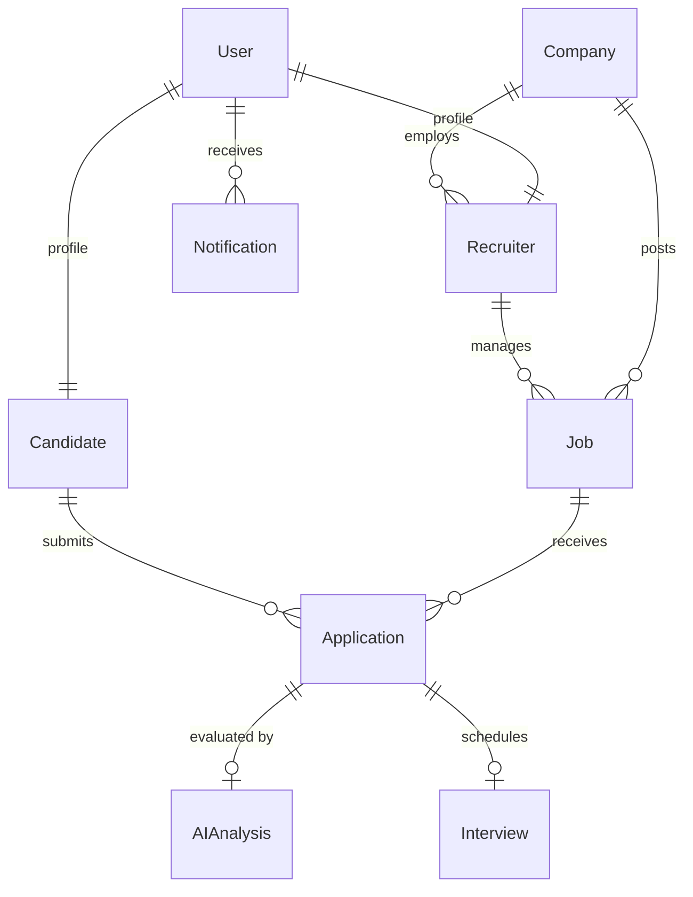

# Database Architecture & Data Dictionary

## 1. Relational Entity Overview

---

## 2. Core Entities

### 2.1 `User` (`accounts_user`)
Custom user model using email as unique identifier.
| Field | Type | Modifiers / Constraints | Description |
| :--- | :--- | :--- | :--- |
| `id` | UUID / BigAutoField | PK | Primary Key |
| `email` | EmailField | UNIQUE, Indexed | User login email |
| `password` | CharField(128) | Hashed | Stored argon2/pbkdf2 hash |
| `first_name` | CharField(150) | Blankable | First name |
| `last_name` | CharField(150) | Blankable | Last name |
| `role` | CharField(20) | Choices: `CANDIDATE`, `RECRUITER`, `ADMIN`, Indexed | Primary system role |
| `is_active` | BooleanField | Default=True | Account active status |
| `is_staff` | BooleanField | Default=False | Admin panel access |
| `created_at` | DateTimeField | auto_now_add=True | Timestamp |
| `updated_at` | DateTimeField | auto_now=True | Timestamp |

---

### 2.2 `Candidate` (`accounts_candidate`)
| Field | Type | Modifiers / Constraints | Description |
| :--- | :--- | :--- | :--- |
| `id` | BigAutoField | PK | Primary Key |
| `user` | OneToOneField(User) | on_delete=CASCADE, related_name='candidate_profile' | Associated User |
| `phone` | CharField(20) | Blankable | Contact number |
| `headline` | CharField(255) | Blankable | Professional title |
| `bio` | TextField | Blankable | Candidate summary |
| `location` | CharField(150) | Blankable | City, Country |
| `resume_file` | FileField | Blankable, upload_to='resumes/%Y/%m/' | Uploaded PDF/DOCX |
| `raw_resume_text` | TextField | Blankable | Extracted raw text |
| `parsed_skills` | JSONField | Default=list | List of extracted skill tags |
| `parsed_education` | JSONField | Default=list | Extracted education history |
| `parsed_experience` | JSONField | Default=list | Extracted experience entries |
| `resume_uploaded_at` | DateTimeField | Nullable | Last resume upload timestamp |
| `created_at` | DateTimeField | auto_now_add=True | Timestamp |
| `updated_at` | DateTimeField | auto_now=True | Timestamp |

---

### 2.3 `Company` (`companies_company`)
| Field | Type | Modifiers / Constraints | Description |
| :--- | :--- | :--- | :--- |
| `id` | BigAutoField | PK | Primary Key |
| `name` | CharField(200) | Indexed | Company legal/operating name |
| `website` | URLField | Blankable | Official website |
| `description` | TextField | Blankable | Company description |
| `industry` | CharField(100) | Blankable | Business industry |
| `location` | CharField(150) | Blankable | HQ location |
| `logo` | ImageField | Blankable, upload_to='company_logos/' | Company logo |
| `is_verified` | BooleanField | Default=False | Admin verification flag |
| `created_at` | DateTimeField | auto_now_add=True | Timestamp |
| `updated_at` | DateTimeField | auto_now=True | Timestamp |

---

### 2.4 `Recruiter` (`accounts_recruiter`)
| Field | Type | Modifiers / Constraints | Description |
| :--- | :--- | :--- | :--- |
| `id` | BigAutoField | PK | Primary Key |
| `user` | OneToOneField(User) | on_delete=CASCADE, related_name='recruiter_profile' | Associated User |
| `company` | ForeignKey(Company) | on_delete=SET_NULL, Nullable, related_name='recruiters' | Affiliated company |
| `designation` | CharField(100) | Blankable | e.g. Technical Recruiter |
| `is_approved` | BooleanField | Default=False | Recruiter affiliation approval |
| `created_at` | DateTimeField | auto_now_add=True | Timestamp |
| `updated_at` | DateTimeField | auto_now=True | Timestamp |

---

### 2.5 `Job` (`jobs_job`)
| Field | Type | Modifiers / Constraints | Description |
| :--- | :--- | :--- | :--- |
| `id` | BigAutoField | PK | Primary Key |
| `company` | ForeignKey(Company) | on_delete=PROTECT, related_name='jobs' | Company offering job |
| `recruiter` | ForeignKey(Recruiter) | on_delete=SET_NULL, Nullable, related_name='managed_jobs' | Recruiter managing posting |
| `title` | CharField(200) | Indexed | Job Title |
| `description` | TextField | | Detailed job description |
| `department` | CharField(100) | Blankable | Engineering, Product, etc. |
| `location` | CharField(150) | | Remote, Hybrid, or City |
| `job_type` | CharField(20) | Choices: `FULL_TIME`, `PART_TIME`, `REMOTE`, `INTERN` | Employment type |
| `experience_min_years`| IntegerField | Default=0, MinValueValidator(0) | Minimum years required |
| `required_skills` | JSONField | Default=list | List of required skills |
| `preferred_skills` | JSONField | Default=list | List of nice-to-have skills |
| `status` | CharField(20) | Choices: `DRAFT`, `OPEN`, `PAUSED`, `CLOSED`, Indexed | Job posting status |
| `created_at` | DateTimeField | auto_now_add=True, Indexed | Timestamp |
| `updated_at` | DateTimeField | auto_now=True | Timestamp |

---

### 2.6 `Application` (`applications_application`)
| Field | Type | Modifiers / Constraints | Description |
| :--- | :--- | :--- | :--- |
| `id` | BigAutoField | PK | Primary Key |
| `job` | ForeignKey(Job) | on_delete=CASCADE, related_name='applications', Indexed | Target Job |
| `candidate` | ForeignKey(Candidate) | on_delete=CASCADE, related_name='applications', Indexed | Applicant |
| `resume_snapshot` | JSONField | Default=dict | Frozen snapshot of parsed resume |
| `status` | CharField(25) | Choices: `APPLIED`, `REVIEWING`, `SHORTLISTED`, `INTERVIEW_SCHEDULED`, `REJECTED`, `HIRED`, Indexed | Current stage |
| `applied_at` | DateTimeField | auto_now_add=True, Indexed | Submission timestamp |
| `updated_at` | DateTimeField | auto_now=True | Last status update |

**Constraints:**
* `UniqueConstraint(fields=['job', 'candidate'], name='unique_candidate_job_application')`

---

### 2.7 `AIAnalysis` (`applications_aianalysis`)
| Field | Type | Modifiers / Constraints | Description |
| :--- | :--- | :--- | :--- |
| `id` | BigAutoField | PK | Primary Key |
| `application` | OneToOneField(Application) | on_delete=CASCADE, related_name='ai_analysis' | Evaluated application |
| `overall_match_score` | FloatField | Min: 0.0, Max: 100.0, Indexed | Weighted composite score |
| `semantic_similarity_score` | FloatField | Min: 0.0, Max: 100.0 | Dense embedding vector match (60%) |
| `skill_match_score` | FloatField | Min: 0.0, Max: 100.0 | Skill overlap match (30%) |
| `experience_match_score` | FloatField | Min: 0.0, Max: 100.0 | Experience alignment (10%) |
| `matched_skills` | JSONField | Default=list | List of skills present in both |
| `missing_skills` | JSONField | Default=list | Required skills absent in resume |
| `experience_match_summary`| TextField | Blankable | Textual summary of experience fit |
| `explanation` | JSONField | Default=dict | Structured explainability payload |
| `model_name` | CharField(100) | Default='all-MiniLM-L6-v2' | Model identifier |
| `model_version` | CharField(50) | Default='1.0.0' | Model release version |
| `created_at` | DateTimeField | auto_now_add=True | Timestamp |

---

### 2.8 `Interview` (`interviews_interview`)
| Field | Type | Modifiers / Constraints | Description |
| :--- | :--- | :--- | :--- |
| `id` | BigAutoField | PK | Primary Key |
| `application` | OneToOneField(Application) | on_delete=CASCADE, related_name='interview' | Linked Application |
| `scheduled_time` | DateTimeField | Indexed | Date & time of interview |
| `duration_minutes` | IntegerField | Default=45, Min: 15, Max: 240 | Duration in minutes |
| `interview_type` | CharField(20) | Choices: `TECHNICAL`, `HR`, `BEHAVIORAL` | Round type |
| `meeting_link_or_location` | CharField(500) | | Virtual meeting URL or room |
| `status` | CharField(20) | Choices: `SCHEDULED`, `COMPLETED`, `CANCELLED`, `RESCHEDULED`, Indexed | Status |
| `feedback` | TextField | Blankable | Recruiter interview feedback |
| `created_at` | DateTimeField | auto_now_add=True | Timestamp |
| `updated_at` | DateTimeField | auto_now=True | Timestamp |

---

### 2.9 `Notification` (`notifications_notification`)
| Field | Type | Modifiers / Constraints | Description |
| :--- | :--- | :--- | :--- |
| `id` | BigAutoField | PK | Primary Key |
| `user` | ForeignKey(User) | on_delete=CASCADE, related_name='notifications', Indexed | Recipient user |
| `title` | CharField(200) | | Short notification title |
| `message` | TextField | | Notification message |
| `notification_type` | CharField(30) | Choices: `APPLICATION_STATUS`, `NEW_APPLICATION`, `INTERVIEW_SCHEDULED`, `SYSTEM` | Type |
| `link_url` | CharField(255) | Blankable | Client navigation target |
| `is_read` | BooleanField | Default=False, Indexed | Read flag |
| `created_at` | DateTimeField | auto_now_add=True, Indexed | Timestamp |
